# Studio for DeepSeek Harness

Themes and personalisation for [DeepSeek Harness](https://github.com/deepseek-ai/deepseek-harness) (DSH): 18 themes, a theme editor that can also build a theme from any picture, a theme per workspace, a community gallery of themes and prompt packs, liquid-glass panels, wallpapers (Bing daily, slideshows and video), fonts, saved looks on a schedule that can follow sunrise and sunset, your Windows accent colour, layout controls and a focus mode, AI modes, task-finished alerts, a usage and cost dashboard with spending alerts, chat export to Markdown and PDF, accessibility options, smarter saved prompts, settings sync, a Ctrl+K quick switcher, and 19 languages.

Zero npm dependencies. Your settings stay on your machine unless you turn on sync.

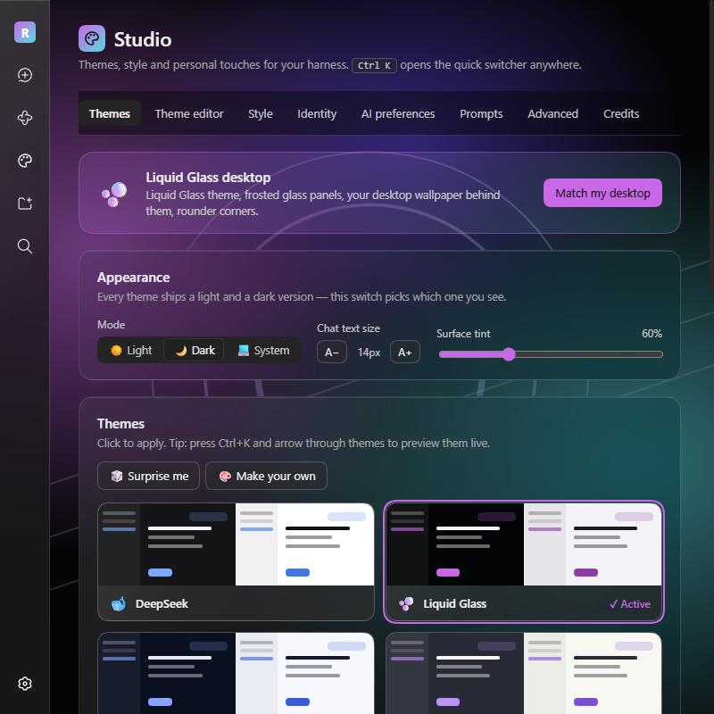

| Liquid glass + personal greeting | Quick switcher (live preview) | Theme editor |
| --- | --- | --- |
| 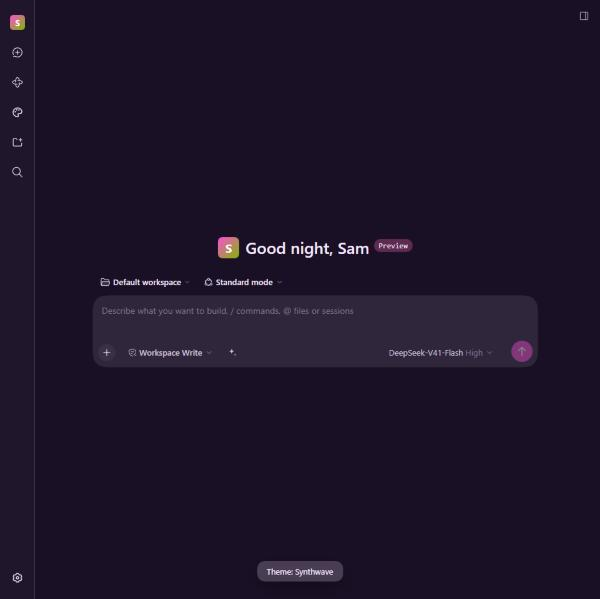 | 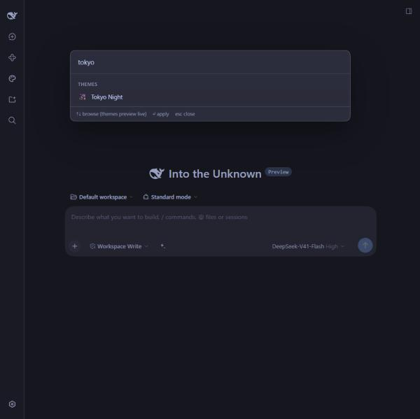 | 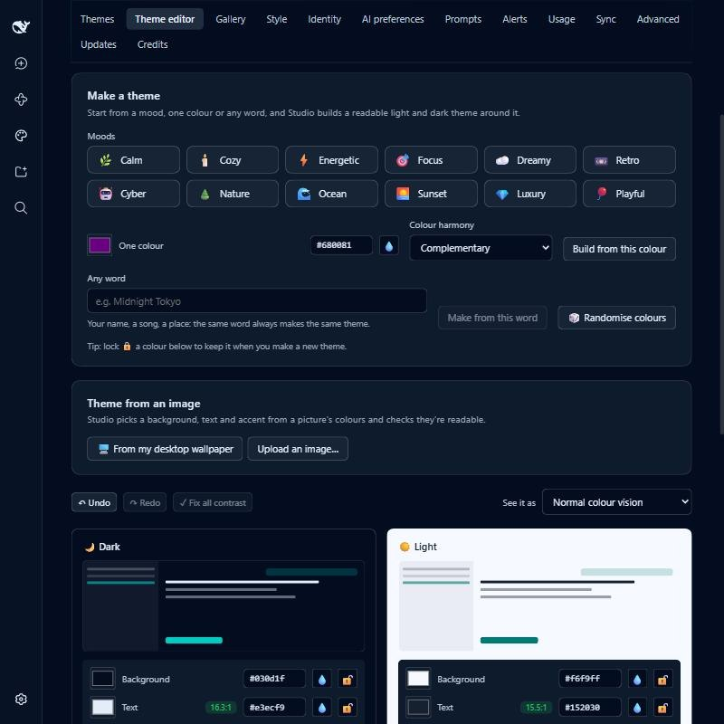 |

| Community gallery | Usage & cost (sample data) | Looks & schedule, in Japanese |
| --- | --- | --- |
| 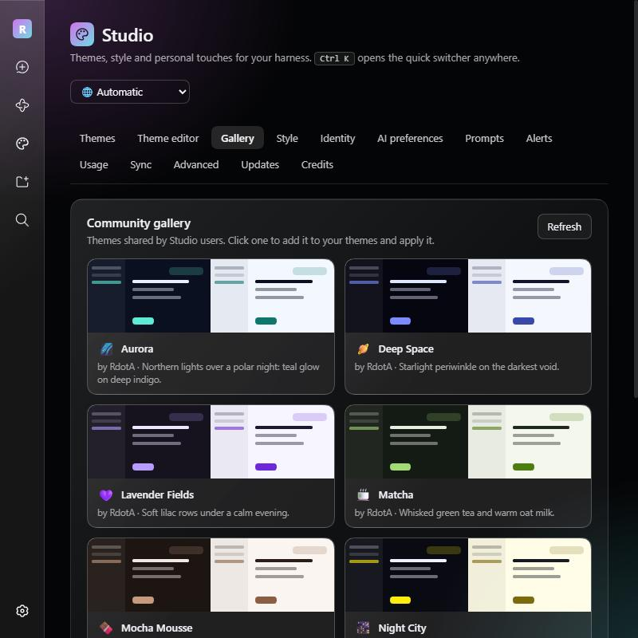 | 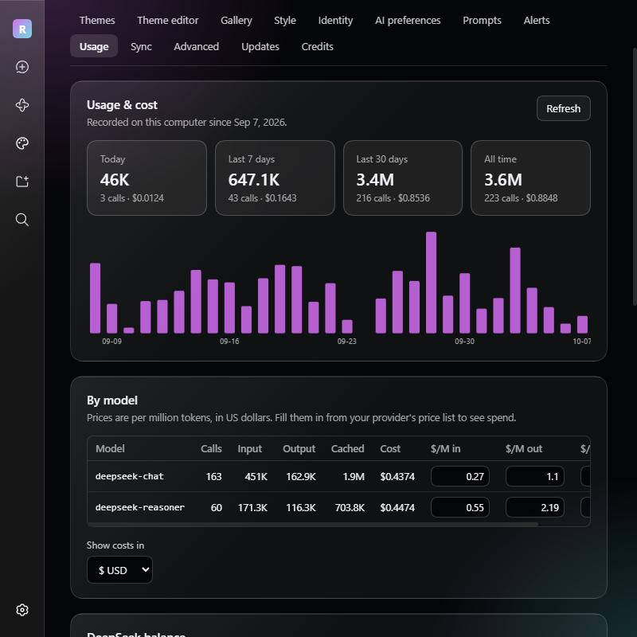 | 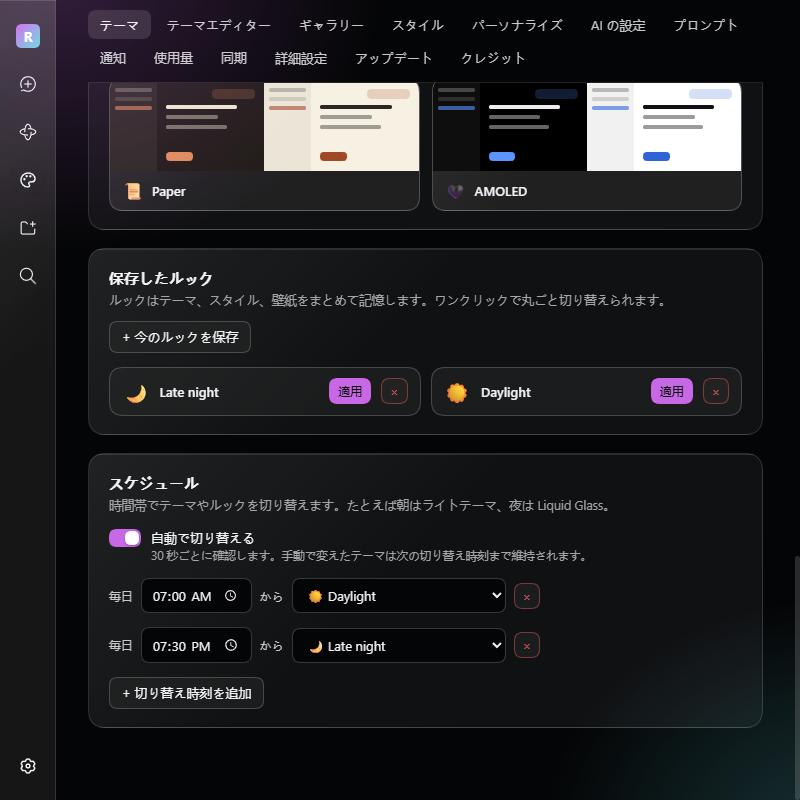 |

| Prompts that ask first | Saved prompts | Light mode (Synthwave) |
| --- | --- | --- |
| 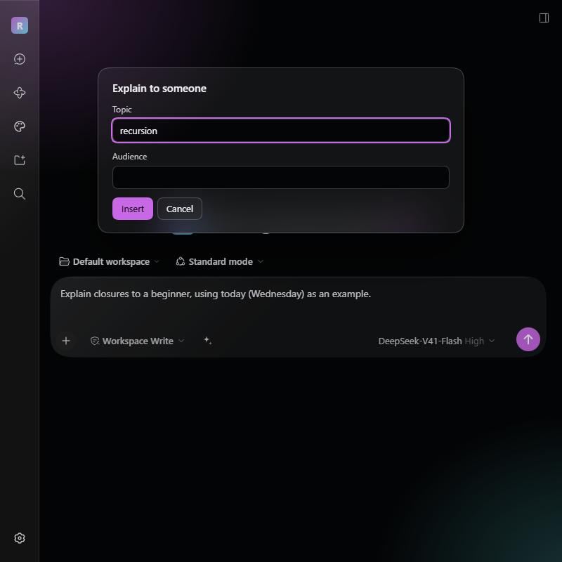 | 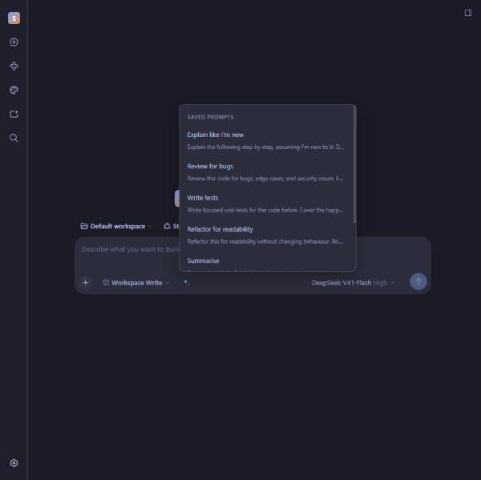 | 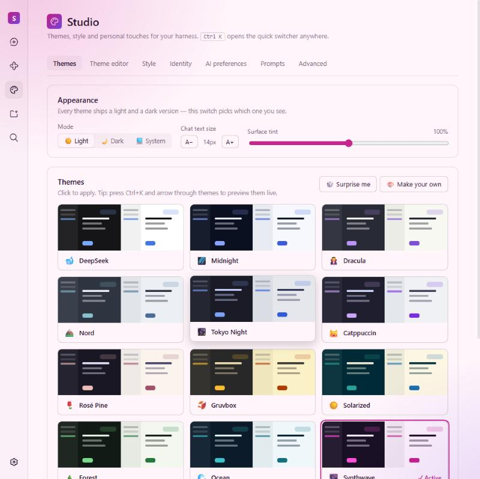 |

## Install

**From the app:** open DSH → sidebar **Plugins** → **Add plugin** → enter

```
github:IRdotAI/dsh-studio
```

**From a terminal:**

```
npx @deepseek-ai/dsh plugin --profile web add github:IRdotAI/dsh-studio
```

Then restart `dsh web`. A **Studio** entry appears in the sidebar. Requires DSH 0.2 (tested with 0.2.0-rc.2), the web profile, and Node 22.5+. `pnpm` must be on your PATH for plugin installs (`npm install -g pnpm`).

Already on 1.3 or later? Studio offers the update itself (**Studio → Updates**).

To remove it, use **Uninstall** on its Plugins page entry.

## Using it

- **Studio** in the sidebar has everything, in tabs. Pick your language in the top-right corner (**Automatic** follows your browser, or DSH itself when it's set to Chinese).
- **Ctrl+K** (Cmd+K on macOS) opens the quick switcher anywhere: themes (arrow through them to preview live; Esc puts yours back), your looks, AI modes, light/dark, text size, chat width, focus mode, ambience, saved prompts, alerts, chat export, backup, updates and every Studio page.
- In the composer, type **/theme**, **/ai**, **/transcript**, **/prompts**, **/focus** or **/studio**, or click the **✦** button beside the input for saved prompts.

## Features

| Area | What you get |
| --- | --- |
| **18 themes** | Liquid Glass, Midnight, Dracula, Nord, Tokyo Night, Catppuccin, Rosé Pine, Gruvbox, Solarized, Forest, Ocean, Synthwave, Sakura, Arc Reactor, Espresso, Paper, AMOLED and High Contrast, plus the stock look. Each has a light and a dark version, so DSH's Light / Dark / System switch keeps working. |
| **Theme per workspace** | Give any workspace its own theme or look, so you can tell your projects apart at a glance. It switches as you move between workspaces and goes back to your usual theme everywhere else. |
| **Theme editor** | Pick a background, text and accent colour per mode. Studio derives every surface, border, button and text shade from them in OKLCH, with contrast floors so secondary text stays readable. Live contrast badges, whole-app preview while editing, 🎲 randomise, and shareable `dshs1:` theme codes. |
| **Theme from an image** | Build a theme from your desktop wallpaper, your Studio wallpaper or any picture: Studio clusters its colours, picks a background tint and accents, and fits them for contrast in both modes. |
| **Community gallery** | **Studio → Gallery** lists themes and prompt packs shared by other users; one click adds a theme or a whole pack of prompts. **Submit to the gallery** in the theme editor, or on a prompt folder, opens GitHub with your file ready to propose. See [gallery/](gallery/). |
| **Looks & schedule** | Save your theme, style and wallpaper together as a named look, then switch whole setups in one click, or on a schedule: at a set time, or at **sunrise** and **sunset** where you are (e.g. a light theme at sunrise, Liquid Glass at sunset). Changing things yourself sticks until the next switch. |
| **Windows colours** | **Use my Windows accent colour** recolours the current theme's highlights to your Windows accent and follows it when you change it; **Follow Windows light/dark** switches with the system. |
| **Liquid glass** | Style → Material turns the sidebar, composer, cards, dialogs, message bubbles and menus into frosted, see-through panes: backdrop blur, a faint frost, a specular top edge and a diagonal sheen. DSH's own surfaces are found at runtime, so it keeps working across DSH updates. **Match my desktop** applies the whole look in one click. |
| **Layout** | Chat width (narrow to full), interface size (75–140 %), and **focus mode**, which folds the sidebar and side panel away. |
| **Wallpaper** | Upload an image or use a URL; (on Windows) **use your desktop wallpaper**, which follows wallpaper changes; **Bing daily**, a new picture every day; a **slideshow** from a folder of images, changing every few minutes to once a day; or a muted, looping **video** that pauses when the window is hidden. Adjustable visibility and blur. |
| **Style** | Interface and code fonts (presets, any installed font, or a folder of `.otf/.ttf/.woff2` files), corner style, accent-tinted chat bubbles, accent text selection, surface tint. |
| **Ambience** | Aurora glow, vignette, film grain or CRT scanlines, with a strength slider. Never blocks clicks; honours reduced motion. |
| **Identity** | Rename the app in the sidebar, swap the logo (emoji, monogram or your own image, removable with one click), and replace the new-chat headline with a greeting like `Good {timeOfDay}, {name}`, in your language. |
| **AI preferences** | Optional custom instructions: your name, about you, a response style (Concise, Thorough, Friendly, Mentor, Butler, Hype), reply language and free-form instructions. **Off by default**; the tab shows exactly what the model will receive. |
| **AI modes** | Saved sets of style, language and instructions: Coding, Writing, Explain simply and Brainstorm to start, plus any you save yourself. Switch with **/ai** in the composer, from Ctrl+K, or on the AI tab. |
| **Saved prompts** | Six starters; add, edit, reorder and file your own into folders. Placeholders fill themselves in when you insert: `{clipboard}`, `{date}`, `{time}`, `{day}`, and `{ask:Topic}`, which asks you first. Share all your prompts as one `dshp1:` pack code, add a pack from a code or file, or send a folder to the gallery. |
| **Chat export** | **/transcript** (or Ctrl+K → Export this chat) saves the open chat as a Markdown file, a PDF (in your theme's colours or plain black on white), or copies it as Markdown. |
| **Task alerts** | A desktop notification and a sound (four built-in, synthesised, with volume) when a task finishes, and optionally when the agent needs your approval or an answer. Only when you're looking elsewhere, and only for tasks longer than a threshold, if you like. |
| **Usage & cost** | Exact token counts from every model call (input, output, cache reads), totals for today, the last 7 and 30 days and all time, a 30-day chart, a per-model table, and recent calls. Enter prices per million tokens to see spend in any of eight currencies. **Check balance** asks DeepSeek for your account balance. |
| **Spending alerts** | Set a daily and/or monthly budget. Studio shows how much of it you've used and alerts you (toast, sound and desktop notification) once when you're close and once when you reach it. |
| **Accessibility** | A High Contrast theme, **Reduce transparency** (solid panels, no wallpaper; follows Windows' own setting), strong keyboard focus outlines, and an easy-reading font with roomier spacing. |
| **Sync** | Back up your Studio settings to a **private** GitHub Gist and restore them on another computer, by hand or automatically a minute after each change. Uploaded images stay local unless you include them. |
| **19 languages** | English, 简体中文, 繁體中文, 日本語, 한국어, Español, Français, Deutsch, Português (Brasil), Italiano, Русский, Українська, Polski, Nederlands, Türkçe, Tiếng Việt, Bahasa Indonesia, हिन्दी and العربية (right-to-left). |
| **Advanced** | Custom CSS (applied last; use the `--dsw-*` design tokens), export/import settings as JSON, reset. |
| **Updates** | Update banner and sidebar dot when a new version is out, optional auto-updates, and every release listed for updating, reinstalling or downgrading. |
| **Credits** | Who made Studio, what it builds on, and where each adapted theme palette comes from. |

## Updates

Studio updates itself from this repo's [releases](https://github.com/IRdotAI/dsh-studio/releases):

- When a new version is out, a banner at the top of Studio (and a dot on its sidebar icon) offers **Update now**, **Turn on auto-updates** and **What's new**.
- **Studio → Updates** lists every release. **Update** to a newer one, **Reinstall** the current one, or **Downgrade** to an older one if a new version gives you trouble.
- With **auto-updates** on, Studio checks GitHub every 6 hours and installs new versions by itself.
- Installs go through DeepSeek Harness's own plugin manager (the same as Plugins → Add plugin) and take effect the next time you restart DeepSeek Harness.
- Your settings are backed up before every install (`~/.dsh/studio/studio.backup-*.json`, newest five kept).
- Downgrading switches auto-updates off, so Studio doesn't jump straight back.
- Versions before 1.3.0 don't have the Updates page; to come back from one, use Plugins → Add plugin → `github:IRdotAI/dsh-studio` again.

One-click updates need Studio to have been installed from GitHub. A copy linked from a local folder (a developer install) says so on the Updates page and updates from that folder instead.

## Privacy

- Settings live in `~/.dsh/studio/studio.json` (or `$DSH_HOME/studio/studio.json`), uploaded images included. Usage records live next to them in `usage.json` and never leave your machine.
- **Sync** is off until you add a GitHub token. The token is kept in `~/.dsh/studio/github-token` (readable only by you), is never sent to the browser, and is only used to talk to GitHub. Backups go to a private gist on your account.
- **Check balance** sends your existing DeepSeek API key to DeepSeek's own balance endpoint, and only when you press it.
- The **Gallery** tab downloads the theme and prompt-pack list from this repository on GitHub.
- AI preferences (and modes) are only added to the model's system prompt while you have them switched on.
- A wallpaper set by **URL** is fetched by your browser from that URL. Uploads, slideshow folders, video files and the desktop wallpaper never leave your machine.
- **Bing daily** downloads the picture of the day from bing.com once a day and keeps the last three in `~/.dsh/studio/bing/`.
- **Sunrise and sunset** use a location you type or allow once; it is rounded to about 10 km and stored only in your settings. The times are worked out on your machine.
- **Chat export** happens in your browser; nothing is uploaded.

## How it works

DSH plugins have a host half (Node) and a browser half (React). Studio's host half stores settings, serves them over authenticated `/api/studio/*` routes, injects the stylesheet into every page load (so your theme is there from the very first frame), serves the desktop wallpaper and font files, reads the Windows accent colour, records token usage from the `llm/stream` waterfall, runs the gist sync, and contributes the optional system-prompt section. The browser half renders the UI and updates the stylesheet live.

Theming works by re-deriving DSH's three static colour scales (`--dsw-static-neutral-bluish-*`, `--dsw-static-neutral-*`, `--dsw-static-deepseek-*`). Every alias token points at them, so the whole interface follows while keeping the original contrast ladder.

| File | Role |
| --- | --- |
| `lib/shared.js` | Pure core: colour maths, presets, palette extraction, stylesheet builder, settings validation, schedule and sun times, prompt placeholders, usage totals and budgets, persona text and modes, chat export. Shared by both halves. |
| `lib/index.js` | Host half: settings file, API routes, first-paint stylesheet, wallpaper (desktop, Bing, slideshow, video) and font serving, gallery and balance lookups, chat export, system-prompt section. |
| `lib/updater.js` | Finds releases on GitHub and installs updates or downgrades through the harness plugin manager. |
| `lib/usage.js` | Usage recorder: wraps `llm/stream` and stores each call's token counts. |
| `lib/windows.js` | Reads the Windows accent colour. |
| `lib/sync.js` | Private-gist backup and restore. |
| `src/client/*.js` | Browser half source, one file per area (store, styles, each tab, quick switcher, composer button, slash commands, entry). |
| `locales/*.json` | Interface text, one file per language. English is built into the bundle; others load on demand. |
| `lib/client.js` | **Generated** browser bundle. Edit `src/client/`, `locales/en.json` or `lib/shared.js`, then run `node scripts/build.mjs`. |
| `gallery/` | Community themes and prompt packs, and the generated `index.json` the Gallery tab reads. |

### API

All routes are behind DSH's own browser authentication.

- `GET /api/studio/state`: settings plus what this machine offers (desktop wallpaper, served fonts, Windows accent)
- `POST /api/studio/patch`: partial update (objects merge, arrays replace)
- `POST /api/studio/replace`: whole-settings import
- `POST /api/studio/reset` with `{"confirm":"reset-studio"}`
- `GET /api/studio/desktop-wallpaper`: the current Windows wallpaper
- `GET /api/studio/bing-wallpaper`: today's Bing picture (downloaded once a day)
- `GET /api/studio/wallpaper-file?i=<n>`: one image from the slideshow folder
- `GET /api/studio/video-wallpaper`: the video wallpaper file (supports `Range`)
- `GET /api/studio/export?session=<id>`: one chat's messages, for export
- `GET /api/studio/font?f=<file>`: a file from the configured font folder (only files in that folder are served)
- `GET /api/studio/updates`: version, releases and update status; `POST` it `{"action":"check"}` or `{"action":"install","version":"x.y.z"}`
- `GET /api/studio/usage`: usage totals and recent calls; `POST` it `{"action":"clear"}` or `{"action":"balance"}`
- `GET /api/studio/sync`: sync status; `POST` it `{"action":"set-token","token":"…"}`, `clear-token`, `push` or `pull`
- `GET /api/studio/gallery`: the community gallery (cached for an hour); `POST` to refresh
- `GET /api/studio/locale?lang=<code>`: one language's interface text

## Development

```
git clone https://github.com/IRdotAI/dsh-studio
cd dsh-studio
node scripts/build.mjs           # rebuild lib/client.js
node test/selftest.mjs           # 39 checks
node scripts/check-locales.mjs   # every language has every string
node scripts/build-gallery.mjs   # validate gallery themes and prompt packs, rebuild gallery/index.json
npx @deepseek-ai/dsh plugin --profile web add "$PWD"   # install your local copy
```

Restart `dsh web` after changing anything under `lib/` (host modules are cached).

**Adding a language:** add it to `LANGUAGES` in `lib/shared.js`, copy `locales/en.json` to `locales/<code>.json`, translate the values (keep every `{placeholder}`), and run `node scripts/check-locales.mjs`.

**DSH plugin pitfalls worth knowing:**

- `connection.fetch.register` paths must be the full path starting with `/api/`; anything else throws "invalid exact Fetch route".
- Exact routes are keyed by path alone, so GET and POST on one path must be one route with `methods: ["GET", "POST"]`.
- A `requestBody: "streaming"` route cannot serve GET (the bridge always attaches a body). Keep reads `buffered`.
- A host-injected `<style>` using `html:root body` selectors outranks DSH's token sheets and also covers the first paint.
- DSH portals its menus to `<body>` and positions them from on-screen rectangles, so scale the app with `zoom` on `#root`, never on `<html>`.

## Credits

Made by **RdotA**. Theme palettes adapted from Dracula, Nord, Catppuccin, Gruvbox, Solarized, Tokyo Night and Rosé Pine. Full credits, with links, are in [CREDITS.md](CREDITS.md) and in the app under **Studio → Credits**.

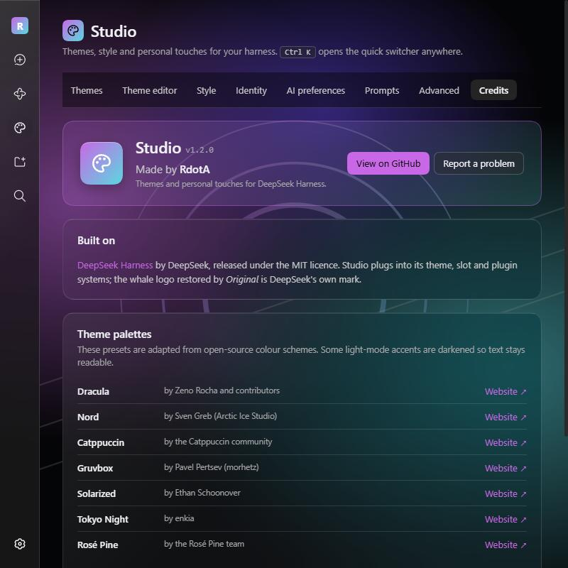

## Licence

[MIT](LICENSE)
